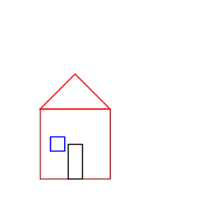
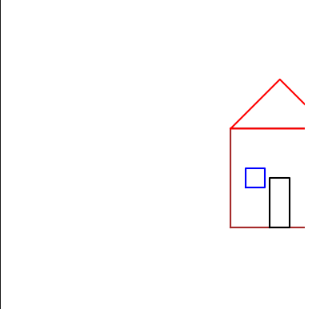
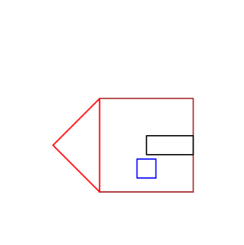
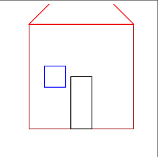

# Taller 0 - Transformaciones Geométricas

Este taller implementa transformaciones geométricas básicas (traslación, rotación y escalado) sobre una figura en forma de casa, primero en **Python (Jupyter/Colab)** y de forma equivalente en **Unity**.

---

## Parte 1: Python

### Breve explicación de cada implementación
1. **Traslación**  
   - Se construye una matriz homogénea 3x3 que desplaza todos los puntos de la figura.  
   - Parámetros: `dx`, `dy`.  

2. **Rotación**  
   - Se construye una matriz homogénea 3x3 para girar la figura un ángulo `θ` respecto al origen.  
   - Parámetro: `angulo` (en grados).  

3. **Escalado**  
   - Se construye una matriz homogénea 3x3 que multiplica los puntos por factores `sx` y `sy`.  
   - Parámetros: `sx`, `sy`.  

4. **Animación**  
   - Se usa `matplotlib.animation.FuncAnimation` para interpolar los valores de traslación, rotación y escala en cada frame.  

### Capturas de pantalla / GIFs 
- Imagen 1: Casa original.  <br>
<br>
- Imagen 2: Traslación aplicada.  <br>
<br>
- Imagen 3: Rotación aplicada.  <br>
<br>
- Imagen 4: Escalado aplicado. <br>
<br>
- GIF: Animación combinada.  <br>
<br>


### Código relevante
El código está en el archivo [`taller_0.py`](.python/taller_0.py) y en el notebook [`Taller_0.ipynb`](.python/Taller_0.ipynb).  

### Funciones principales (Python)
```python
import numpy as np

# Traslación
def traslacion(x, y, dx, dy):
    T = np.array([[1, 0, dx],
                  [0, 1, dy],
                  [0, 0, 1]])
    puntos = np.column_stack([x, y, np.ones(len(x))])
    puntos_t = (T @ puntos.T).T
    return puntos_t[:,0], puntos_t[:,1]

# Rotación
def rotacion(x, y, angulo):
    a = np.deg2rad(angulo)
    R = np.array([[ np.cos(a), -np.sin(a), 0],
                  [ np.sin(a),  np.cos(a), 0],
                  [ 0,          0,         1]])
    puntos = np.column_stack([x, y, np.ones(len(x))])
    puntos_t = (R @ puntos.T).T
    return puntos_t[:,0], puntos_t[:,1]

# Escalado
def escalado(x, y, sx, sy):
    S = np.array([[sx, 0, 0],
                  [0, sy, 0],
                  [0,  0, 1]])
    puntos = np.column_stack([x, y, np.ones(len(x))])
    puntos_t = (S @ puntos.T).T
    return puntos_t[:,0], puntos_t[:,1]

---

