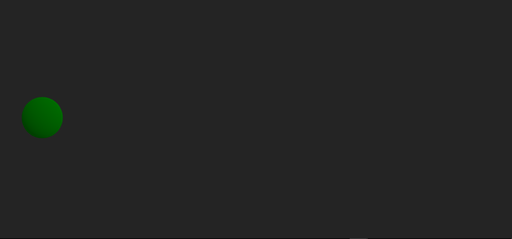
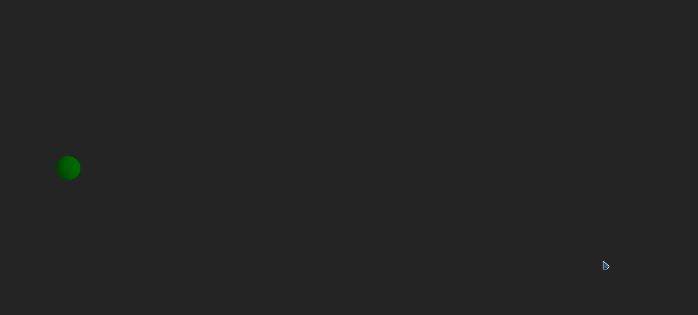
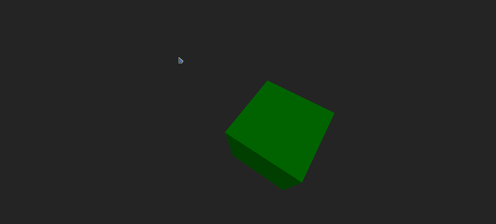
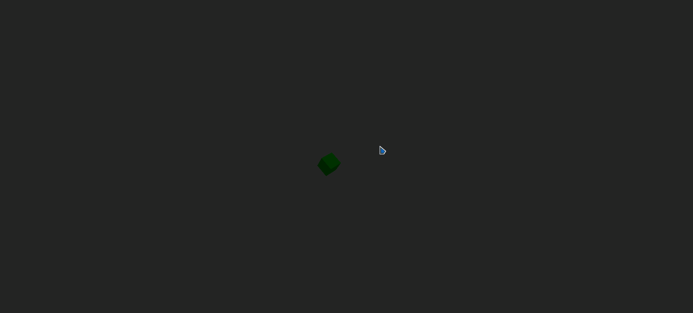

# Taller 0 - Transformaciones Geométricas

Este taller implementa transformaciones geométricas básicas (traslación, rotación y escalado) sobre una figura en forma de casa, primero en **Python (Jupyter/Colab)** y de forma equivalente en **Unity**.

---

## Parte 1: Python

### Breve explicación de cada implementación
1. **Traslación**  
   - Se construye una matriz homogénea 3x3 que desplaza todos los puntos de la figura.  
   - Parámetros: `dx`, `dy`.  

2. **Rotación**  
   - Se construye una matriz homogénea 3x3 para girar la figura un ángulo `θ` respecto al origen.  
   - Parámetro: `angulo` (en grados).  

3. **Escalado**  
   - Se construye una matriz homogénea 3x3 que multiplica los puntos por factores `sx` y `sy`.  
   - Parámetros: `sx`, `sy`.  

4. **Animación**  
   - Se usa `matplotlib.animation.FuncAnimation` para interpolar los valores de traslación, rotación y escala en cada frame.  

### Capturas de pantalla / GIFs 
- Imagen 1: Casa original.  <br>
<br>
- Imagen 2: Traslación aplicada.  <br>
<br>
- Imagen 3: Rotación aplicada.  <br>
<br>
- Imagen 4: Escalado aplicado. <br>
<br>
- GIF: Animación combinada.  <br>
<br>


### Código relevante
El código está en el archivo [`taller_0.py`](python/taller_0.py) y en el notebook [`Taller_0.ipynb`](python/Taller_0.ipynb).  

### Funciones principales (Python)
```python
import numpy as np

# Traslación
def traslacion(x, y, dx, dy):
    T = np.array([[1, 0, dx],
                  [0, 1, dy],
                  [0, 0, 1]])
    puntos = np.column_stack([x, y, np.ones(len(x))])
    puntos_t = (T @ puntos.T).T
    return puntos_t[:,0], puntos_t[:,1]

# Rotación
def rotacion(x, y, angulo):
    a = np.deg2rad(angulo)
    R = np.array([[ np.cos(a), -np.sin(a), 0],
                  [ np.sin(a),  np.cos(a), 0],
                  [ 0,          0,         1]])
    puntos = np.column_stack([x, y, np.ones(len(x))])
    puntos_t = (R @ puntos.T).T
    return puntos_t[:,0], puntos_t[:,1]

# Escalado
def escalado(x, y, sx, sy):
    S = np.array([[sx, 0, 0],
                  [0, sy, 0],
                  [0,  0, 1]])
    puntos = np.column_stack([x, y, np.ones(len(x))])
    puntos_t = (S @ puntos.T).T
    return puntos_t[:,0], puntos_t[:,1]
```

---

## Parte 2: React Three Fiber / Animaciones 3D

### Breve explicación de cada implementación

1. **Esfera inicial**

   * Se crea una esfera de radio 3 y color verde usando `<sphereGeometry>`.
   * Representa la figura base sobre la que se aplicarán transformaciones.

2. **Traslación en trayectoria circular**

   * Se usa `useFrame` para actualizar la posición de la esfera en cada frame:

     * `x = 3 * cos(t)`
     * `z = 3 * sin(t)`
   * El movimiento es continuo y suave usando el tiempo delta.

3. **Cubo rotando sobre su propio eje**

   * Se añadió un cubo de tamaño 3x3x3 y color verde.
   * Se aplica rotación sobre los ejes X e Y en cada frame (`rotation.x += 0.02`, `rotation.y += 0.02`).
   * Simultáneamente se mantiene la traslación circular y un escalado suave usando `Math.sin(clock.elapsedTime)`.

4. **OrbitControls**

   * Se agregó `OrbitControls` desde `@react-three/drei` para permitir navegar la escena: rotar cámara, hacer zoom y mover el punto de vista.
   * La cámara inicial se posiciona alejada `[10, 10, 10]` para ver toda la escena.

---

### Capturas de pantalla / GIFs

- Imagen 1: Esfera inicial
  

- Imagen 2: Traslación circular aplicada
  

- Imagen 3: Cubo rotando y escalando
  

- GIF: Animación completa con OrbitControls
  

---

### Código relevante

El código está en [`App.jsx`](threejs/taller-0/App.jsx) y contiene toda la escena en React Three Fiber.

```jsx
import { Canvas, useFrame } from '@react-three/fiber';
import { OrbitControls } from '@react-three/drei';
import { useRef } from 'react';

function CuboCircular() {
  const meshRef = useRef();
  let t = 0;

  useFrame((state, delta) => {
    t += delta;

    // Movimiento circular
    meshRef.current.position.x = 3 * Math.cos(t);
    meshRef.current.position.z = 3 * Math.sin(t);

    // Rotación sobre su propio eje
    meshRef.current.rotation.x += 0.02;
    meshRef.current.rotation.y += 0.02;

    // Escalado suave
    const scale = 1 + 0.3 * Math.sin(state.clock.elapsedTime);
    meshRef.current.scale.set(scale, scale, scale);
  });

  return (
    <mesh ref={meshRef}>
      <boxGeometry args={[3, 3, 3]} />
      <meshStandardMaterial color="green" />
    </mesh>
  );
}

export default function App() {
  return (
    <Canvas
      style={{ width: '100vw', height: '100vh' }}
      camera={{ position: [10, 10, 10], fov: 75 }}
    >
      <ambientLight intensity={0.5} />
      <directionalLight position={[10, 10, 10]} intensity={1} />
      <CuboCircular />
      <OrbitControls />
    </Canvas>
  );
}
```

---

### Explicación rápida

* `CuboCircular` combina **traslación circular + rotación + escalado** en un solo componente.
* `OrbitControls` permite explorar la escena desde cualquier ángulo.
* La escena ocupa toda la pantalla y la iluminación asegura que la esfera y el cubo se vean correctamente.

---

Si quieres, puedo generar también la **sección final completa del README.md** uniendo Parte 1 (Python) y Parte 2 (React Three Fiber) para que quede lista para entregar. ¿Quieres que haga eso?
