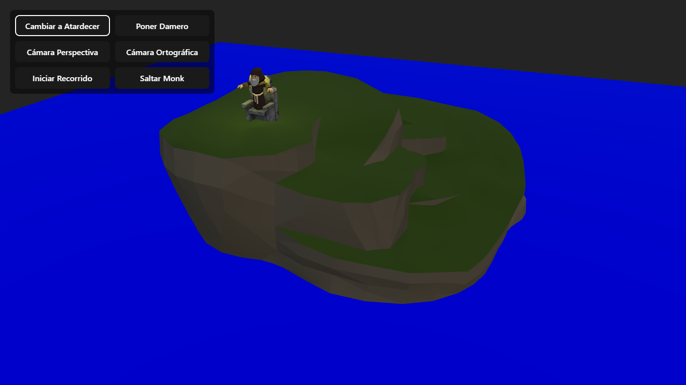
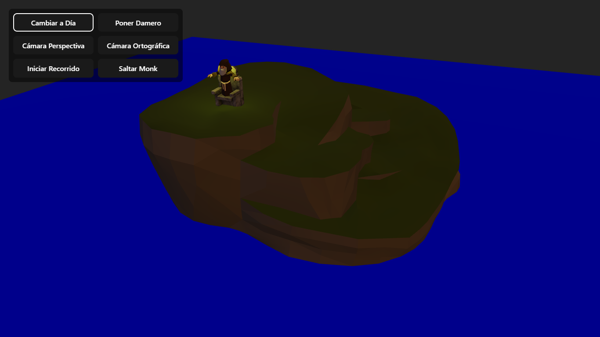
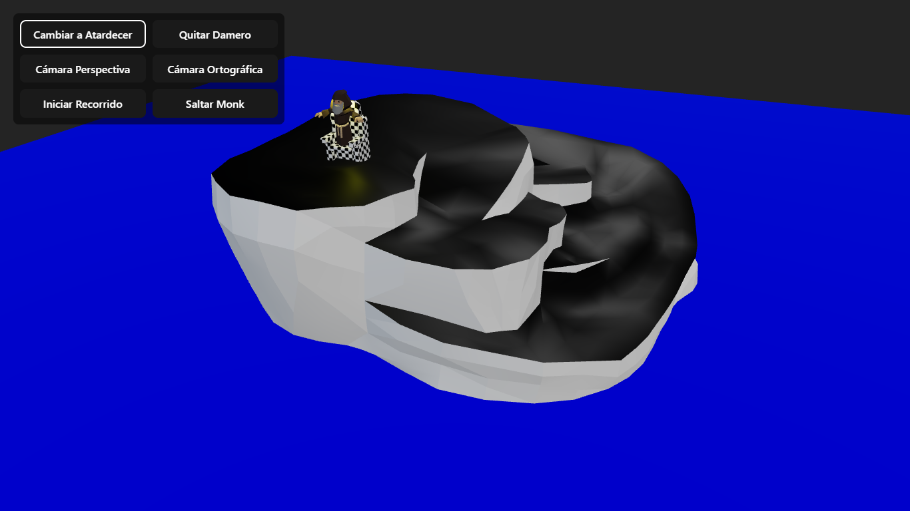
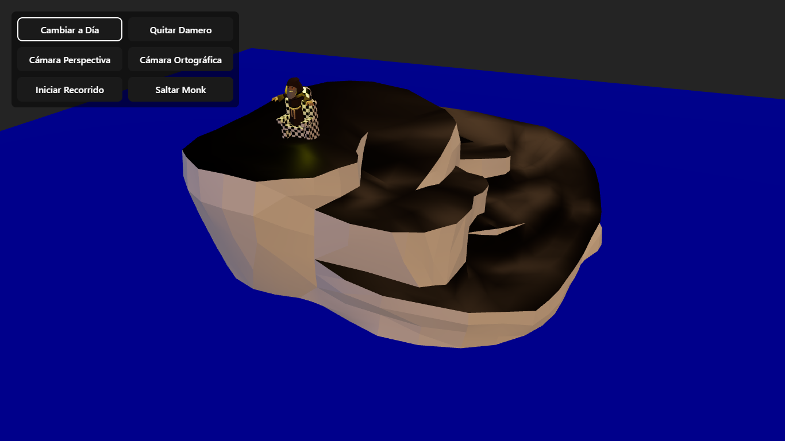
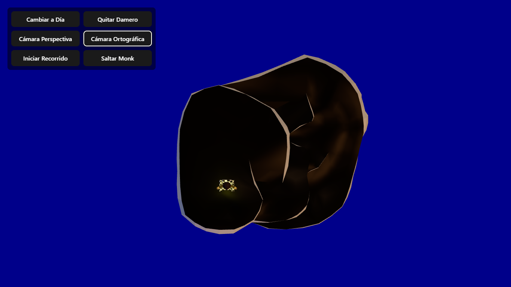
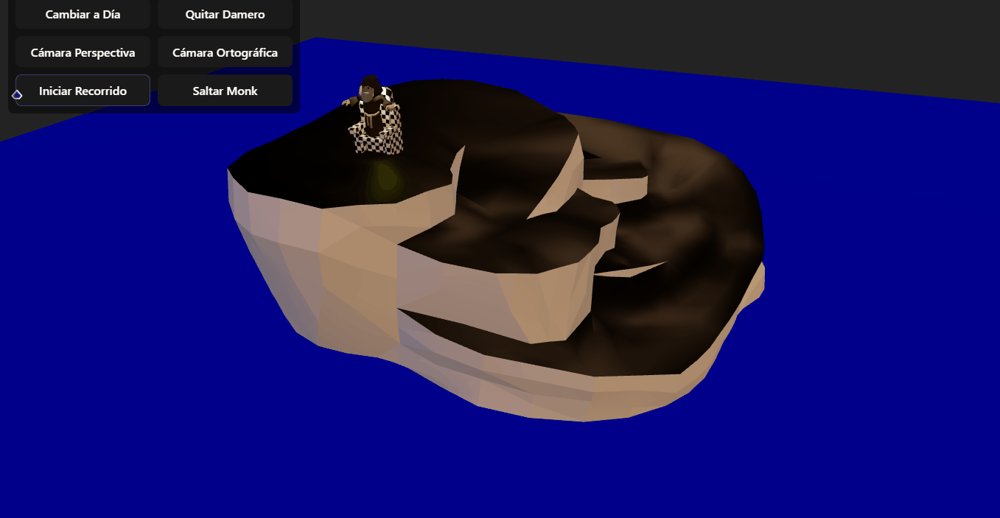

# Mundo 3D Interactivo

## Concepto y Idea Principal
Este proyecto representa un **mundo 3D interactivo** que combina un paisaje fantástico con un trono, una isla y un personaje animado (Monk). La idea principal es mostrar cómo los cambios de iluminación, materiales y cámaras afectan la percepción visual del entorno, utilizando **texturas PBR, shaders procedurales y animaciones simples**.

## Modelos GLB Usados
| Nombre del Modelo | Fuente | Modificaciones |
|------------------|--------|----------------|
| throne_of_rock.glb | Descargado de `/glb_models/` | Escala: 0.008, Posición: [-2, 4.3, 2.6], Material: original o con damero |
| medieval_fantasy_-_large_island.glb | Descargado de `/glb_models/` | Escala: 0.4, Posición: [17, 0, 18], Material: original o con damero |
| monk_character.glb | Descargado de `/glb_models/` | Escala: 1, Posición inicial: [-2, 4.7, 3], Material: original o con damero |

## Iluminación
Se implementaron **tres tipos de luces direccionales** y una luz ambiental:
- **Key Light:** luz principal con color blanco (día) o cálido (atardecer), intensidad variable.
- **Fill Light:** suaviza sombras, color azul claro o violeta según preset.
- **Rim Light:** resalta bordes, color blanco o cálido según preset.
- **Ambient Light:** luz general para todo el escenario, intensidad ajustable según preset.

### Presets de iluminación:
- **Día:** ambient 0.5, key blanco, fill azul claro, rim blanco.
- **Atardecer:** ambient 0.3, key naranja, fill azul, rim naranja claro.

## Materiales y Texturas
Se aplicaron materiales **PBR estándar**:
- **Roughness:** 0.5 en damero, valores originales para otros materiales.
- **Metalness:** 0.1 en damero, valores originales para otros materiales.
- **Normal Map:** se mantiene según modelo original.
- **Justificación:** se buscó equilibrio visual y contraste entre superficies metálicas y no metálicas, evitando reflejos exagerados.

## Shaders Procedurales
- **Damero:** aplicado a todos los meshes cuando se activa el toggle, repeticiones: 4x4, colores blanco y negro.
- Se podrían añadir otros shaders como ruido o bandas, pero actualmente solo se implementó el damero.

## Cámaras
- **Perspectiva:** proporciona sensación de profundidad y realismo; usada para la visualización general.
- **Ortográfica:** elimina perspectiva, útil para inspección técnica de la escena y composición arquitectónica.
- **Recorrido:** cámara en movimiento circular alrededor del punto de interés, combinando perspectiva y animación para efecto cinematográfico.

## Animaciones
- **Monk:** salto vertical periódico, junto con la luz puntual que lo sigue.
- **Luces:** intensidad y posición de la luz del Monk varían durante el salto, simulando brillo dinámico.
- **Cámara:** recorrido circular opcional alrededor de la escena.

## Paleta de colores RGB

**Preset Día**

* **Ambient / Fondo general:** gris claro → `RGB(128, 128, 128)`
* **Key Light (principal):** blanco → `RGB(255, 255, 255)`
* **Fill Light (suave):** azul claro → `RGB(160, 207, 255)`
* **Rim Light (resalte):** blanco → `RGB(255, 255, 255)`
* **Suelo / plano:** azul intenso → `RGB(0, 0, 255)`

**Preset Atardecer**

* **Ambient / Fondo general:** gris tenue → `RGB(77, 77, 77)`
* **Key Light (principal):** naranja cálido → `RGB(255, 184, 112)`
* **Fill Light (suave):** azul suave → `RGB(127, 161, 255)`
* **Rim Light (resalte):** naranja pálido → `RGB(255, 207, 160)`

**Shaders / Damero**

* **Blanco:** `RGB(255, 255, 255)`
* **Negro:** `RGB(0, 0, 0)`

- **Justificación:** alto contraste perceptual para resaltar personajes y objetos importantes; se considera el espacio CIELAB para asegurar legibilidad y diferenciación visual.

## Capturas de pantalla / GIFs
- Imagen 1: Escena en modo Día.   
 
- Imagen 2: Escena en modo Atardecer.   
 
- Imagen 3: Damero aplicado en luz Día.   
 
- Imagen 4: Damero aplicado en luz Atardecer.   
 
- Imagen 5: Vista de cámara Ortográfica.   
 
- GIF 1: Recorrido de cámara por la escena.   
 
- GIF 2: Saltos del monk con luz animada.   
 
