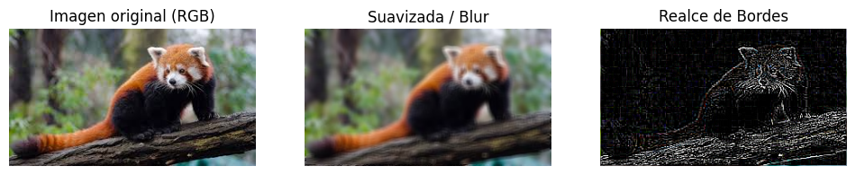
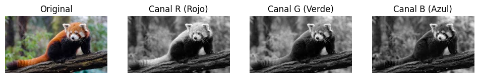
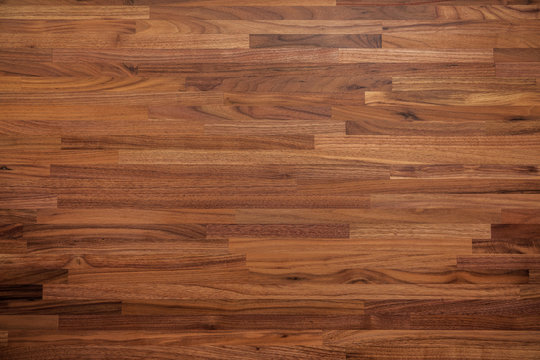
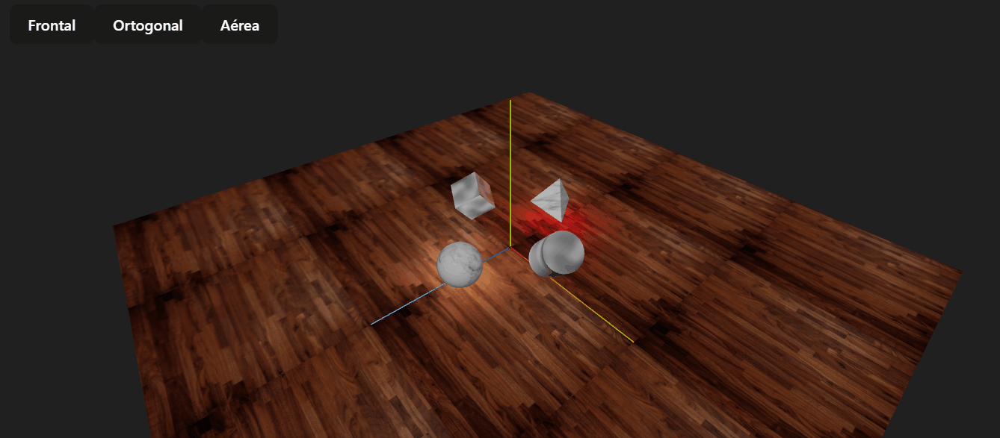
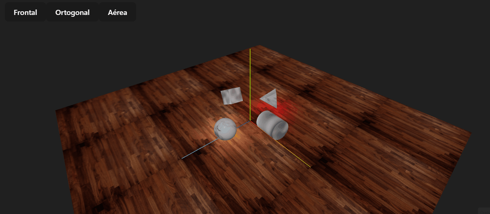

# Punto 1 – Procesamiento de Imágenes en Python
Este proyecto aplica diferentes técnicas de procesamiento digital de imágenes utilizando Python y la librería Pillow (PIL). Se trabaja con una imagen de un panda rojo en un entorno natural, sobre la cual se realizan filtros básicos, separación de canales, operaciones morfológicas y una animación mostrando los resultados.

# 1. Filtros Básicos

Se aplicaron dos filtros:

### Suavizado (Blur)
Se usa `ImageFilter.BLUR` para reducir ruido y suavizar texturas.

### Realce de Bordes
Se usa `ImageFilter.FIND_EDGES` para resaltar contornos y formas predominantes.

### Resultados

---

# 2. Visualización de Canales de Color (R, G, B)

Se separó la imagen en sus tres canales utilizando `imagen.split()`.

Cada canal se muestra en escala de grises.

### Resultados

### Explicación de los canales

En la imagen del panda rojo:

- **Canal R**  
  El pelaje del panda rojo y partes del tronco aparecen más claras porque contienen más información en el rango rojizo. El fondo verde aparece más oscuro.

- **Canal G**  
  La vegetación del fondo se ve más clara debido a su naturaleza verdosa. El panda se ve más oscuro porque su color contiene menos componente verde.

- **Canal B**  
  Las áreas con tonos azulados o sombras frías se ven más claras. El panda y el tronco se ven más oscuros porque contienen poca intensidad en el canal azul.

---

# 3. Operaciones Morfológicas

Se trabajó primero convirtiendo la imagen a escala de grises mediante `imagen.convert("L")`.

Se aplicaron dos operaciones:

### Dilatación
Utilizando un kernel definido manualmente, la dilatación expande las zonas claras, haciendo que estructuras brillantes crezcan.

### Erosión
La erosión disminuye las zonas claras y elimina pequeños puntos brillantes, reduciendo el grosor de regiones intensas.

### Resultados

### Explicación

- **Dilatación:** resalta las zonas brillantes, haciendo que bordes y formas claras se expandan.  
- **Erosión:** reduce detalles pequeños y atenúa bordes claros, dando una apariencia más "delgada" a las estructuras.

---

# 4. Animación Secuencial (GIF o cuadros mostrados)

Se generaron frames donde se muestran:

1. Imagen original  
2. Suavizado  
3. Realce de bordes  
4. Dilatación  
5. Erosión

La animación se muestra en pantalla y opcionalmente se puede guardar como GIF.

Ejemplo mostrado:

.gif)

----

# Punto 2 – Escena con Formas Básicas en Three.js (50%)

Este proyecto contiene una **escena 3D interactiva** construida con **Three.js** y **React Three Fiber**.

## 1. Escena 3D con Formas Básicas

Se creó una escena 3D con las siguientes figuras geométricas animadas:

- **Cubo**
- **Esfera**
- **Cilindro**
- **Tetraedro**

Cada figura tiene animaciones continuas usando `useFrame` de React Three Fiber:

- Rotación sobre varios ejes.
- Movimiento vertical oscilante en la esfera.

---

## 2. Texturas

Se aplicaron **texturas diferenciadas** a los objetos y al piso:

- Carpeta de texturas: `threejs/textures`
  - `floor.jpg` → textura del piso.
  - `metal.jpg` → aplicada al cubo y cilindro.
  - `marble.jpg` → aplicada a la esfera y al tetraedro.

**Ejemplo de piso con textura:**

**Ejemplo de cubo con textura metal:**

---

## 3. Iluminación

Se añadieron varias luces para darle realismo a la escena:

- `ambientLight` → luz ambiental suave.
- `directionalLight` → luz principal proveniente de arriba.
- `pointLight` en el centro de la escena.
- `pointLight` cerca de la esfera, para destacar su textura y movimiento.

---

## 4. Controles de Cámara y OrbitControls

Se integró **OrbitControls** para permitir al usuario:

- Girar la cámara alrededor de la escena.
- Acercar y alejar la vista (zoom).
- Mantener siempre la escena completa visible.

### Botones de cambio de perspectiva

Se implementaron tres perspectivas diferentes, seleccionables mediante botones:

1. **Frontal**: vista desde una diagonal superior.
2. **Ortogonal**: vista lateral de la escena.
3. **Aérea**: vista desde arriba.

---

## 5. Animaciones

Todas las figuras están animadas de forma continua:

- Rotaciones en distintos ejes.
- Oscilación vertical de la esfera.

---

## 6. OrbitControls en acción

El usuario puede interactuar con la cámara mediante el mouse o trackpad:

- Girar la escena.
- Acercar o alejar la vista.
- Mantener las figuras siempre visibles mientras se mueve la cámara.

---

## 7. Estructura del proyecto

