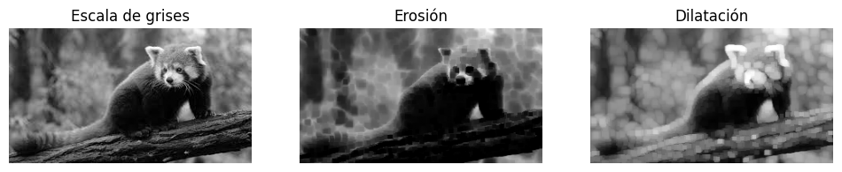

# Punto 1 – Procesamiento de Imágenes en Python
Este proyecto aplica diferentes técnicas de procesamiento digital de imágenes utilizando Python y la librería Pillow (PIL). Se trabaja con una imagen de un panda rojo en un entorno natural, sobre la cual se realizan filtros básicos, separación de canales, operaciones morfológicas y una animación mostrando los resultados.

## Requisitos

Instalar Pillow:
```
pip install pillow
```

## Archivo principal
El código utilizado se encuentra en `Python.ipynb` y realiza los siguientes procesos:

---

# 1. Filtros Básicos

Se aplicaron dos filtros:

### Suavizado (Blur)
Se usa `ImageFilter.BLUR` para reducir ruido y suavizar texturas.

### Realce de Bordes
Se usa `ImageFilter.FIND_EDGES` para resaltar contornos y formas predominantes.

### Resultados


---

# 2. Visualización de Canales de Color (R, G, B)

Se separó la imagen en sus tres canales utilizando `imagen.split()`.

Cada canal se muestra en escala de grises.

### Resultados


### Explicación de los canales

En la imagen del panda rojo:

- **Canal R**  
  El pelaje del panda rojo y partes del tronco aparecen más claras porque contienen más información en el rango rojizo. El fondo verde aparece más oscuro.

- **Canal G**  
  La vegetación del fondo se ve más clara debido a su naturaleza verdosa. El panda se ve más oscuro porque su color contiene menos componente verde.

- **Canal B**  
  Las áreas con tonos azulados o sombras frías se ven más claras. El panda y el tronco se ven más oscuros porque contienen poca intensidad en el canal azul.

---

# 3. Operaciones Morfológicas

Se trabajó primero convirtiendo la imagen a escala de grises mediante `imagen.convert("L")`.

Se aplicaron dos operaciones:

### Dilatación
Utilizando un kernel definido manualmente, la dilatación expande las zonas claras, haciendo que estructuras brillantes crezcan.

### Erosión
La erosión disminuye las zonas claras y elimina pequeños puntos brillantes, reduciendo el grosor de regiones intensas.

### Resultados



### Explicación

- **Dilatación:** resalta las zonas brillantes, haciendo que bordes y formas claras se expandan.  
- **Erosión:** reduce detalles pequeños y atenúa bordes claros, dando una apariencia más "delgada" a las estructuras.

---

# 4. Animación Secuencial (GIF o cuadros mostrados)

Se generaron frames donde se muestran:

1. Imagen original  
2. Suavizado  
3. Realce de bordes  
4. Dilatación  
5. Erosión

La animación se muestra en pantalla y opcionalmente se puede guardar como GIF.

Ejemplo mostrado:

.gif)
